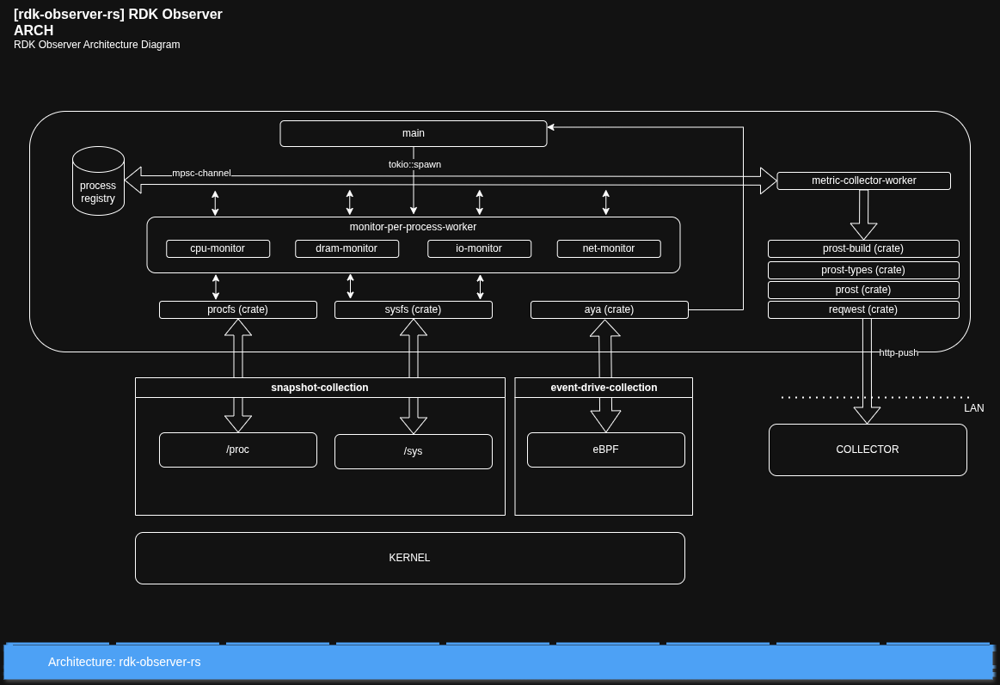

# rdk-observer-rs

`rdk-observer-rs` is a system process observer for RDK devices. Its goal is to inspect running processes, create records from the observations, and send those records to a backend for analysis and monitoring.

## Problem solved

It provides continuous, low-overhead observability of system resources across an RDK device, including CPU, DRAM, processes, network, and I/O activity.

In a resource-constrained device, the main goal is to understand **where the available resources are going** and which processes or kernel activities are consuming them. By combining system metrics, process-level information, and Linux observability mechanisms, the component helps track resource usage over time, correlate transient events with their likely cause, and provide the data needed to evaluate the efficiency of current components and support future architectural decisions.

Unlike `top` or `htop`, which primarily provides an immediate view of resource usage while it is running, RDK-Observer is designed to collect timestamped observations continuously and export compact telemetry for long-term analysis. This makes it possible to identify gradual memory growth, recurring load patterns, intermittent peaks, and changes in process behavior that may not be visible in a momentary view.

Periodic sampling alone can miss short-lived processes that start and exit between snapshots. RDK-Observer therefore uses eBPF process-lifecycle events to detect process creation, execution, and exit promptly. These events update the Process Registry and can trigger targeted per-PID observation, allowing transient activity to be correlated with the surrounding CPU, DRAM, network, and I/O measurements. Procfs remains the source of resource snapshots, while eBPF complements it by revealing when short-lived activity occurs.

## Planned tracking options

The observer is intended to support multiple ways to choose what to track:

- All user-space processes.
- Kernel processes and threads, where the system exposes them.
- Processes associated with RDK-B.
- Individually selected processes.

These options will allow deployments to choose between a broad system view and focused monitoring of specific processes.

This repository is currently a project scaffold; the observer and its tracking options are planned functionality.

## Functional requirements

All resource monitors must operate at per-process granularity and attribute observations to the stable process identity (`PID + start_time`) whenever the Linux kernel exposes the required data. System-wide metrics must also be collected to provide context. Metrics that cannot be attributed reliably to an individual process must remain identified as system-wide rather than being assigned inaccurately.

### Process registry

- Track running processes and their lifecycle.
- Maintain stable identity using `PID + start_time`.
- Collect metadata such as name, executable, parent PID, and command line.
- Keep current and recent historical process information.
- Provide a shared process registry to the other monitors.
- Minimize discovery overhead.

### CPU resource management

- Monitor overall CPU utilization.
- Track CPU usage per process.
- Measure load and CPU pressure.
- Track context switches.
- Collect relevant perf/PMU counters.
- Detect short CPU peaks and unusual CPU activity.

### DRAM resource management

- Monitor total, available, and used DRAM.
- Track memory usage per process using RSS, PSS, and private memory.
- Monitor page cache and kernel slab usage.
- Track memory pressure using PSI.
- Monitor page faults, reclaim, swap, and other memory activity.
- Detect memory growth, peaks, and potential OOM conditions.

### Storage resource monitor

- Monitor system storage read/write activity.
- Track I/O usage per process.
- Monitor I/O operations, throughput, and latency where available.
- Track I/O pressure using PSI.
- Detect processes generating unusually high storage activity.

### Network resource monitor

- Monitor traffic per network interface.
- Track network resource usage per process.
- Track RX/TX bytes and packets.
- Monitor packet drops and errors.
- Track interface state and link changes.
- Collect relevant network-stack statistics.
- Detect unusual traffic or network resource consumption.

### Aggregator and metrics manager

- Receive metrics from all monitoring workers.
- Correlate CPU, DRAM, network, and I/O information with processes.
- Maintain short-term historical data.
- Calculate averages, peaks, deltas, and trends.
- Reduce high-frequency samples into compact telemetry.
- Control the frequency at which metrics are exported.
- Track the overhead introduced by the component itself.

### Collector (external)

- Collect metrics from RDK-Observer and store them.
- Provide dashboards and initial analysis.
- Potentially provide input to an AI model for deeper analysis.

## Deliverables

RDK-Observer should have clear non-functional deliverables, including maximum storage footprint, CPU and DRAM usage, and portability across RDK-B platforms. The component can also run inside a dedicated **cgroup**, allowing resource limits to be enforced and validated during operation.

### Initial resource targets

The initial resource targets for RDK-Observer are approximately **5 MB maximum storage footprint**, **10 MB maximum DRAM usage**, and **below 5% CPU utilization** under normal operation. The component will run in a dedicated **cgroup** so these resource limits can be measured and, where appropriate, enforced.

## Architecture

The following describes the target architecture. `rdk-observer` is designed as a **single Rust process built around the Tokio asynchronous runtime**.

The architecture separates:

- Process discovery.
- Per-process resource monitoring.
- Metric aggregation.
- Backend reporting.

The main design objective is to provide continuous observability while keeping the monitoring overhead low enough for a resource-constrained RDK gateway.



### Main coordination

The `main` task acts as the coordinator of the component.

It initializes the common infrastructure, starts long-running workers using `tokio::spawn()`, and reacts to changes in the Process Registry.

When a new process is discovered, `main` uses a common worker-launching function to create a dedicated monitoring task for that process.

```text
main
 │
 ├── start Process Discovery
 ├── start Metric Collector
 │
 └── on new process
        │
        └── tokio::spawn(process_monitor(pid))
```

### Process Registry

The Process Registry maintains the central view of the processes currently being observed. It tracks:

- PID.
- Parent PID.
- Process name.
- Executable.
- Start time.
- End time.
- Current state.

The Process Registry provides a common source of process information for the rest of the observer.

```text
Process discovered
       │
       ▼
Process Registry
       │
       ▼
main
       │
       ▼
spawn Process Monitor Worker
```

Communication between the asynchronous parts of the component is performed through Tokio `mpsc` channels, keeping process discovery, monitoring, and metric collection loosely coupled.

### Snapshot collection

The snapshot collection path obtains the current state of the Linux system using information exposed through `/proc` and `/sys`.

#### `procfs`

The `procfs` crate provides access to information exposed through `/proc`. It is the main source for CPU, memory, process, and I/O metrics.

```text
/proc
 │
 └── procfs
      ├── /proc/stat
      ├── /proc/meminfo
      ├── /proc/diskstats
      ├── /proc/<pid>/stat
      ├── /proc/<pid>/status
      ├── /proc/<pid>/smaps_rollup
      └── /proc/<pid>/io
```

Typical information collected includes:

- System CPU counters.
- Per-process CPU consumption.
- System DRAM usage.
- Per-process RSS, PSS, and private memory.
- Disk I/O statistics.
- Per-process I/O.
- PSI resource-pressure information.

#### `sysfs`

The `/sys` filesystem complements `/proc` with information related to devices, drivers, interfaces, and hardware.

```text
/sys
 │
 └── sysfs access
      ├── network interfaces
      ├── device statistics
      ├── hardware information
      ├── thermal information
      └── platform-specific attributes
```

### Per-process monitoring workers

When a new process is discovered, a Process Monitor Worker is created dynamically.

Each process worker contains several logical resource monitors:

```text
Process Monitor Worker
 │
 ├── CPU Monitor
 ├── DRAM Monitor
 ├── I/O Monitor
 └── Network Monitor
```

#### CPU Monitor

Typical metrics include:

- CPU utilization.
- User and system CPU time.
- Context switches.
- CPU migrations.
- Optional perf/PMU counters.

CPU utilization can be calculated from the difference between consecutive `/proc/<pid>/stat` samples.

#### DRAM Monitor

Typical metrics include:

- RSS.
- PSS.
- Private memory.
- Shared memory.
- Swap usage.
- Memory growth over time.

The main sources are:

- `/proc/<pid>/status`
- `/proc/<pid>/smaps_rollup`

#### I/O Monitor

Typical information includes:

- Bytes read.
- Bytes written.
- Read operations.
- Write operations.
- I/O rate over time.

The main source is `/proc/<pid>/io`.

#### Network Monitor

The Network Monitor provides the network-related resource view of a process. Information may come from:

- `/sys`.
- Netlink.
- eBPF.
- Kernel network statistics.

Network activity is attributed to a process when reliable socket-to-process attribution is available. Interface-level and non-attributable network metrics remain system-wide observations.

### Sampling strategy

Sampling is divided into two complementary paths:

1. **Full-system snapshots** collect system-wide state from sources such as `/proc/stat`, `/proc/meminfo`, `/proc/diskstats`, PSI, and `/sys`. These snapshots provide the overall resource baseline and run at a lower, configurable frequency because they cover the complete device.
2. **Per-PID sampling** uses a dedicated Process Monitor Worker to read only the relevant `/proc/<pid>/...` sources for one process. These targeted reads can run more frequently than full-system snapshots because each operation accesses a smaller scope. Every observation is associated with the stable process identity (`PID + start_time`) before aggregation.

Different per-PID metrics also have different collection costs. Cheap sources such as `/proc/<pid>/stat` can be sampled frequently, while more expensive sources such as `/proc/<pid>/smaps_rollup` use a slower interval. Initial per-PID sampling intervals are:

| Metric | Sampling interval |
| --- | --- |
| CPU | 1–2 seconds |
| I/O | 5 seconds |
| DRAM | 5–10 seconds |
| PSS | 15–30 seconds |
| Network | 5 seconds |

Each per-PID monitor runs as an independent asynchronous task. Instead of reading every process as part of one large burst, these tasks schedule their targeted reads across the sampling interval and yield while waiting for work to complete. Staggering or adding jitter to those schedules, together with limiting read concurrency, prevents all workers from accessing the kernel interfaces simultaneously. This distributes the collection cost over time, reduces artificial CPU and I/O peaks, and provides more efficient access to kernel information. Asynchronous execution keeps the coordinator responsive, while the scheduling and concurrency controls are what reduce the peaks.

Each measurement includes its own timestamp.

### Event-driven collection

In addition to snapshot collection, `rdk-observer` includes an event-driven observability path based on eBPF.

```text
Kernel
  │
  ▼
eBPF
  │
  ▼
Aya
```

The Aya crate provides the Rust interface to eBPF programs.

- Snapshot collection answers: **What does the system look like now?**
- Event-driven collection answers: **What just happened?**

One of the initial use cases is process lifecycle detection. The observer can detect events such as:

- Process start.
- Process execution.
- Process exit.

These events update the Process Registry and allow `main` to start or stop process monitoring workers dynamically.

The same infrastructure can later support:

- Scheduler events.
- Page faults.
- Perf/PMU events.
- Memory-pressure events.
- Kernel tracepoints.
- Other transient kernel activity.

### Metric Collector Worker

The Metric Collector Worker is the common destination for observations generated by the monitoring workers.

```text
CPU Worker ──────┐
DRAM Worker ─────┤
I/O Worker ──────┤
Network Worker ──┼── mpsc ──> Metric Collector
eBPF Events ─────┘
```

Its main responsibilities include:

- Receiving metrics asynchronously.
- Associating metrics with the corresponding process.
- Calculating deltas and rates.
- Calculating averages and peaks.
- Keeping short-term historical state.
- Controlling reporting frequency.
- Preparing records for serialization.
- Sending metrics to the backend collector.

Collection frequency and reporting frequency are intentionally separated.

```text
CPU sampling       every 1 second
DRAM sampling      every 5 seconds
PSS sampling       every 30 seconds
                         │
                         ▼
                 Metric Collector
                         │
                         ▼
Backend push       every 30 seconds
```

This allows detailed local observability without generating excessive network traffic.

### Serialization and Protobuf encoding

Observation records use Protocol Buffers (Protobuf), as decided in [ADR-0004](docs/architecture/adr/0004-observation-record-format-decision.md). Shared `.proto` definitions specify the record schema. [`prost-build`](https://docs.rs/prost-build/latest/prost_build/) generates Rust message types, and [`prost`](https://docs.rs/prost/latest/prost/) encodes and decodes them.

```text
Shared .proto schema
          │
          ▼
      prost-build
          │
          ▼
Rust message types
          │
          ▼
        prost
          │
          ▼
    Protobuf bytes
```

Example record schema:

```proto
syntax = "proto3";

message ProcessMetrics {
    uint32 pid = 1;
    optional float cpu = 2;
    optional uint64 rss_kb = 3;
    optional uint64 pss_kb = 4;
    optional uint64 read_bytes = 5;
    optional uint64 write_bytes = 6;
}
```

Encoding a generated message with `prost`:

```rust
use prost::Message;

let buffer = metrics.encode_to_vec();
```

Protobuf produced the smallest payloads and fastest serialization and deserialization in the recorded benchmarks. Explicit field presence distinguishes unavailable measurements from zero, and the observer and backend share the same schema.

### Backend communication

The Metric Collector Worker uses the `reqwest` crate for asynchronous communication with the backend collector.

```text
Metric Collector
       │
       ▼
     prost
       │
       ▼
 Protobuf bytes
       │
       ▼
    reqwest
       │
       ▼
   HTTP push
       │
       ▼
Backend Collector
```

`reqwest` integrates with Tokio and sends the encoded Protobuf payload asynchronously over HTTP. The HTTP request identifies the binary payload with the [Protobuf MIME type](https://protobuf.dev/reference/protobuf/mime-types/):

```http
Content-Type: application/protobuf
```

### Overall data flow

```text
                     Kernel
                       │
          ┌────────────┴────────────┐
          │                         │
       /proc /sys                 eBPF
          │                         │
     procfs/sysfs                  Aya
          │                         │
          ▼                         ▼
  Resource snapshots       lifecycle/events
          │                         │
          └──────────┬──────────────┘
                     ▼
              Process Registry
                     │
             dynamic spawning
                     │
                     ▼
           Process Monitor Workers
             CPU / DRAM / I/O /
                  Network
                     │
                    mpsc
                     │
                     ▼
             Metric Collector
                     │
                   prost
                     │
               Protobuf bytes
                     │
                  reqwest
                     │
                     ▼
             Backend Collector
```

### Architecture summary

The architecture is based on five main principles:

1. Use `/proc` and `/sys` for low-overhead resource snapshots.
2. Use eBPF and Aya for process lifecycle and transient kernel events.
3. Use Tokio tasks and `mpsc` channels to coordinate monitoring workers dynamically.
4. Centralize aggregation and reporting in the Metric Collector Worker.
5. Use shared Protobuf schemas and `prost` to encode compact observation records for transmission to the backend.

This architecture allows `rdk-observer` to understand where CPU, DRAM, I/O, and network resources are being consumed while minimizing the observer's own impact on a resource-constrained RDK gateway.

## Architecture decisions

- [ADR-0001: Collect System Resource Snapshots from procfs](docs/architecture/adr/0001-collect-system-resource-snapshots-from-procfs.md)
- [ADR-0002: Schedule Per-Process Sampling Workers](docs/architecture/adr/0002-schedule-per-process-sampling-workers.md)
- [ADR-0003: Trigger Process Capture with Aya and BPF Events](docs/architecture/adr/0003-trigger-process-capture-with-bpf-events.md)
- [ADR-0004: Observation Record Format Decision](docs/architecture/adr/0004-observation-record-format-decision.md)
